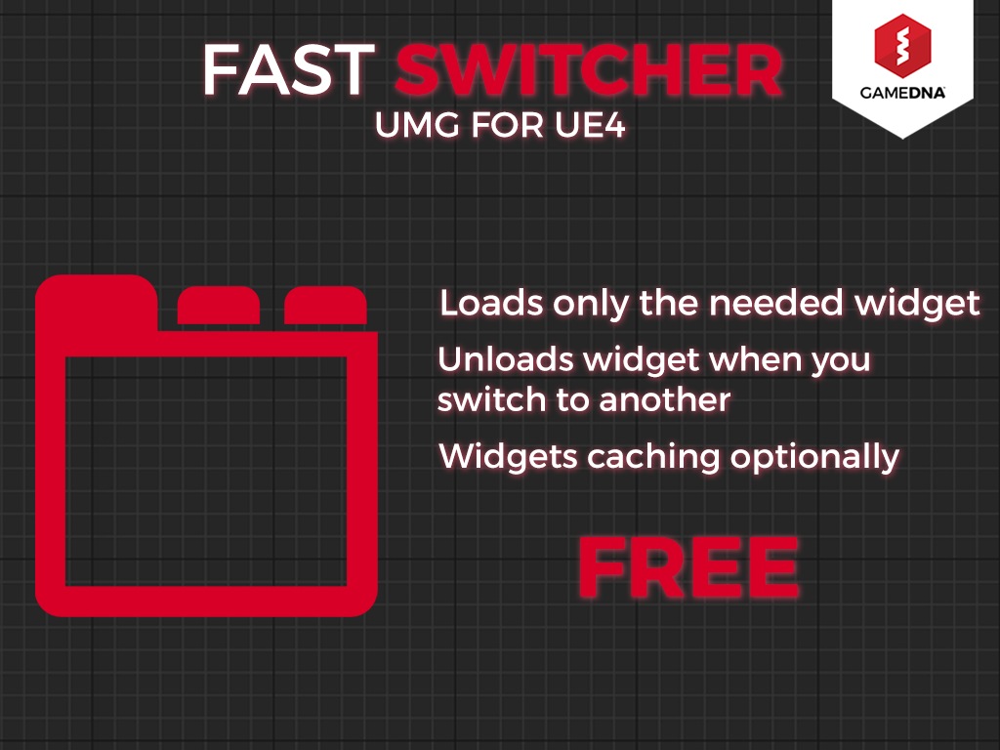

# Fast Switcher

**Fast Switcher** for Unreal Motion Graphics loads only the needed widget. Default widget switcher in Unreal Engine 4 loads all widgets into the memory and switches between them without unloading inactive ones. The Fast Switcher for Unreal Motion Graphics widget loads only the needed one and unloads it when you switch to another. Widgets caching functionality can be optionally enabled. Fast Switcher is made in Blueprints.

**Current version:** 1.5.0

## Features
* Loads only the needed widget
* Unloads widget when you switch to another
* Widgets caching optionally
* Exposed to Blueprints
* No additional libraries are needed

## User Guide
More info about plugin and installation instructions you can find in [User Guide](Documentation/FastSwitcher_UserGuide.pdf).
